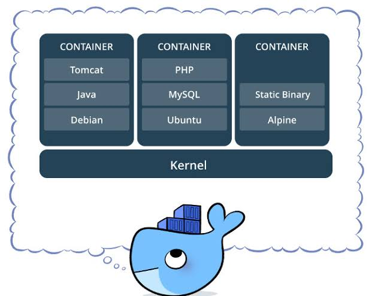

Docker es una plataforma que permite empaquetar una aplicación junto con sus dependencias (versión exacta de Python, librerías y configuraciones del sistema) dentro de una unidad aislada llamada **contenedor**. Esto garantiza que tu código se ejecute exactamente igual en tu portátil, en el ordenador de un compañero o en un servidor en la nube.



---

**Conceptos clave:**

* **Dockerfile:** Archivo de texto sin extensión que contiene la "receta" paso a paso para construir el entorno.
* **Imagen:** El resultado comprimido de ejecutar el `Dockerfile` (la plantilla congelada de tu aplicación).
* **Contenedor:** La instancia en ejecución de una imagen.

---

1. **Instalar Docker Desktop:** El motor que ejecutará los contenedores en tu sistema.
1. Descarga e instala **Docker Desktop** desde **[docker.com](https://www.docker.com/)**.
2. Durante la instalación en Windows, asegúrate de mantener marcada la opción para habilitar **WSL 2** (Windows Subsystem for Linux).
3. Reinicia tu ordenador si el instalador lo solicita y abre Docker Desktop para comprobar que el servicio está activo.


2. **Crear la carpeta del proyecto:** Prepara la estructura básica de tu código.
Crea una carpeta en tu ordenador con dos archivos principales:

* `main.py`: El código fuente de tu aplicación.
* `requirements.txt`: La lista de librerías externas que necesita tu código (puedes generarlo ejecutando `pip freeze > requirements.txt` en la terminal).


3. **Escribir el archivo Dockerfile:** La receta para construir la imagen aislada.
En la raíz de la carpeta de tu proyecto, crea un archivo llamado `Dockerfile` (sin extensión `.txt` ni `.py`) con el siguiente contenido:

```dockerfile
# 1. Usar una imagen base oficial de Python ligera
FROM python:3.12-slim

# 2. Definir el directorio de trabajo dentro del contenedor
WORKDIR /app

# 3. Copiar la lista de dependencias e instalarlas
COPY requirements.txt .
RUN pip install --no-cache-dir -r requirements.txt

# 4. Copiar todo el resto del proyecto al contenedor
COPY . .

# 5. Comando que se ejecutará al arrancar el contenedor
CMD ["python", "main.py"]

```


4. **Construir la imagen de Docker:** Compila tu código y dependencias en un paquete.
1. Abre la terminal dentro de PyCharm o la consola de Windows en la ruta de tu proyecto.
2. Ejecuta el comando de construcción asignándole un nombre (etiqueta `-t`):

```bash
docker build -t mi-app-python .

```

*(El punto `.` al final indica que Docker debe buscar el `Dockerfile` en el directorio actual).*


5. **Ejecutar el contenedor:** Despliega tu código dentro del contenedor aislado.
1. Lanza el contenedor con el comando `run`:

```bash
docker run --rm mi-app-python

```

2. Si tu script es una API o aplicación web que escucha en un puerto (por ejemplo, el puerto 8000), debes enlazar el puerto de tu ordenador con el del contenedor usando el argumento `-p`:

```bash
docker run --rm -p 8000:8000 mi-app-python

```