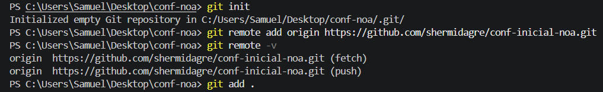
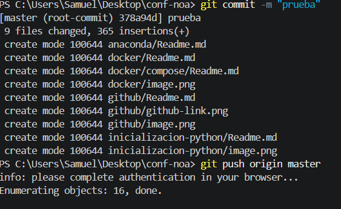

Git es la herramienta que registra el historial de cambios de tu código en tu ordenador, mientras que GitHub es la plataforma en la nube donde almacenas y compartes esos proyectos.

Para que lo entiendas es una pagina donde tu tienes tu cuenta y puedes crear tanto repositorios publicos como privados para guardar y exponer to codigo y asi controlando el propio control de versiones del mismo

A parte de esta guia te dejo otra

https://www.skillnest.com/blog/como-empezar-a-usar-github/

1. **Instalación y configuración inicial:** Prepara tu equipo para usar control de versiones.
1. Descarga e instala **Git** desde **[git-scm.com](https://git-scm.com/)** aceptando las opciones por defecto.
2. Abre la terminal (o Git Bash) y configura tu nombre y correo para identificarte en tus proyectos:

```bash
git config --global user.name "Tu Nombre"
git config --global user.email "tu@email.com"

```


2. **Crear un repositorio en GitHub:** El espacio en la nube donde guardarás tu código.
1. Regístrate en **[github.com](https://github.com/)** si aún no tienes cuenta.
2. Haz clic en el botón **+** (esquina superior derecha) y selecciona **New repository**.
3. Asigna un nombre a tu proyecto (ejemplo: `mi-primer-proyecto`), déjalo como **Public** y pulsa **Create repository**.
4. Copia la URL de HTTPS que te mostrará la pantalla (tipo `[https://github.com/usuario/mi-primer-proyecto.git](https://github.com/usuario/mi-primer-proyecto.git)`).


3. **Inicializar y conectar tu proyecto local:** Vincula la carpeta de tu ordenador con el proyecto de la nube.
En la terminal de PyCharm o la consola dentro de la carpeta de tu proyecto en tu ordenador, ejecuta en orden:

```bash
git init
git branch -M main
git remote add origin https://github.com/tu-usuario/mi-primer-proyecto.git

```


4. **El flujo de trabajo básico (Guardar y Subir):** El ciclo que repetirás cada vez que hagas cambios.
Cada vez que escribas o modifiques código y quieras guardarlo en GitHub, ejecuta estos 3 comandos clave:

1. **`git add .`** — Prepara todos los archivos modificados en la "caja de envío".
2. **`git commit -m "Añadida función principal"`** — Cierra la caja y le pone una etiqueta descriptiva de lo que has hecho.
3. **`git push -u origin main`** — Sube la caja a GitHub.


5. **Recuperar o clonar un proyecto:** Descarga tu código en cualquier otro ordenador.
* Para descargar un repositorio completo en un equipo nuevo:

```bash
git clone https://github.com/tu-usuario/mi-primer-proyecto.git

```

* Si trabajas en varios equipos y quieres bajar los cambios más recientes creados en otro lugar:

```bash
git pull origin main

```


---

### Resumen de comandos esenciales

| Comando | ¿Qué hace en el proyecto? |
| --- | --- |
| `git status` | Muestra qué archivos se han modificado y cuáles faltan por guardar. |
| `git add .` | Incluye todos los cambios recientes para el próximo guardado. |
| `git commit -m "mensaje"` | Guarda una versión fija en el historial local con una nota. |
| `git push` | Envía las versiones guardadas locales al servidor de GitHub. |
| `git log` | Muestra la lista con el historial de todos los *commits* realizados. |


----

Ej .



