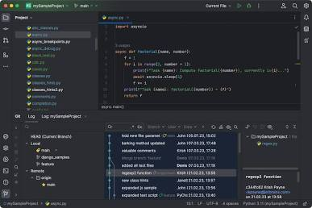

Para configurar Python y PyCharm desde cero en un ordenador con Windows sin instalaciones previas, sigue este manual ordenado paso a paso.

1. **Instalar el motor de Python en Windows:** Imprescindible para que el sistema reconozca los comandos de Python.
1. Ve a la web oficial **[python.org/downloads](https://www.python.org/downloads/)** y haz clic en el botón amarillo **Download Python** (descargará la última versión estable).
2. Ejecuta el archivo descargado (`.exe`).
3. **Paso fundamental:** En la parte inferior de la primera ventana que aparece, **marca la casilla que dice `Add python.exe to PATH**`. Si no marcas esto, el terminal no reconocerá los comandos `python` ni `pip`.
4. Haz clic en **Install Now** y espera a que finalice. Al terminar, haz clic en **Close**.


*(Este paso lo puedes tmabien hacer desde anaconda directo)*
2. **Instalar PyCharm Community Edition:** Asegúrate de bajar la versión Community (gratuita).
1. Entra en **[jetbrains.com/pycharm/download](https://www.google.com/search?q=https://www.jetbrains.org/pycharm/download/)**.
2. Desplázate hacia abajo hasta encontrar **PyCharm Community Edition** (la versión *Professional* es de pago).
3. Descarga el instalador ejecutable para Windows.
4. Abre el archivo ejecutable y avanza haciendo clic en **Next**. En la pantalla de opciones de instalación, se recomienda activar:
* **Create Desktop Shortcut** (crear acceso directo en el escritorio).
* **Add "Open Folder as Project"** (permite abrir carpetas directamente en PyCharm desde el explorador).


5. Haz clic en **Install** y luego finaliza la instalación.


3. **Crear tu primer proyecto en PyCharm:** El entorno virtual aislará las librerías de cada proyecto.
1. Abre PyCharm. Si te pide aceptar términos o importar configuraciones, acepta y selecciona **Don't Import Settings**.
2. En la pantalla de bienvenida, haz clic en **New Project**.
3. En el apartado **Location**, elige la carpeta donde guardarás el proyecto (ejemplo: `C:\Proyectos\mi_primer_proyecto`).
4. En la sección **Python Environment / Interpreter**:
* Selecciona la opción **Virtualenv** (o *New Environment using Virtualenv*).
* PyCharm detectará automáticamente el ejecutable de Python que instalaste en el Paso 1.


5. Haz clic en **Create**. PyCharm creará la estructura del proyecto y una carpeta interna llamada `venv`.


4. **Usar la terminal de PyCharm y ejecutar pip install:** Aprende a usar la consola para instalar paquetes externos.
1. En la parte inferior izquierda del entorno de PyCharm, haz clic en la pestaña **Terminal** (o usa el atajo `Alt + F12`).
2. Observa el inicio de la línea de comandos: debe aparecer la etiqueta **`(venv)`** al principio. Esto indica que la terminal ya está dentro del entorno virtual del proyecto.
3. Para instalar cualquier librería externa, escribe el comando `pip install` seguido del nombre del paquete. Por ejemplo:

```bash
pip install requests

```

4. Si deseas instalar varias herramientas comunes para practicar, puedes ejecutar:

```bash
pip install pandas numpy matplotlib

```

5. Para ver qué paquetes tienes instalados en este proyecto actual, escribe:

```bash
pip list

```


5. **Escribir y ejecutar tu primer script:** Comprobar que el código y los paquetes funcionan juntos.
1. En el panel izquierdo (*Project*), haz clic derecho sobre la carpeta principal de tu proyecto.
2. Selecciona **New** > **Python File** y nombra al archivo `main.py`.
3. Si instalaste el paquete `requests` en el paso anterior, escribe este código para verificar que todo responde correctamente:

```python
import requests

respuesta = requests.get("https://api.github.com")
print("Estado de la conexión:", respuesta.status_code)
print("¡Tu entorno de Python y PyCharm está configurado correctamente!")

```

4. Haz clic derecho en cualquier parte dentro del editor de código y selecciona **Run 'main'** (o presiona `Shift + F10`). El resultado aparecerá en la ventana de ejecución inferior.


---

### ¿Cómo funciona el entorno virtual (`venv`) y por qué es vital?


Cuando trabajas en Python, **cada proyecto debe tener su propio entorno aislado**:

* **Sin `venv` (Mala práctica):** Todas las librerías se instalan de forma global en Windows. Si un proyecto necesita la versión 1.0 de una herramienta y otro proyecto necesita la versión 2.0, surgirán conflictos que romperán tus programas.
* **Con `venv` (Buena práctica):** PyCharm crea una carpeta `venv` dentro de tu proyecto. Cuando ejecutas `pip install` desde la terminal de PyCharm, los archivos se descargan **únicamente dentro de esa carpeta**. Tu sistema operativo se mantiene limpio y libre de conflictos.

---

### Configurar la Terminal (Bash / PowerShell) en PyCharm

Si tienes instalado **Git for Windows** y prefieres que la terminal integrada de PyCharm use comandos de **Git Bash** en lugar del Símbolo del sistema o PowerShell tradicional:

1. Ve a **File** > **Settings** (o presiona `Ctrl + Alt + S`).
2. Navega a **Tools** > **Terminal**.
3. En la casilla **Shell path**, cambia la ruta por la de tu ejecutable de Git Bash (por ejemplo: `C:\Program Files\Git\bin\bash.exe`).
4. Haz clic en **Apply** y **OK**. Al abrir una nueva pestaña en la Terminal de PyCharm, esta cargará un entorno Bash con el `(venv)` activo automáticamente.